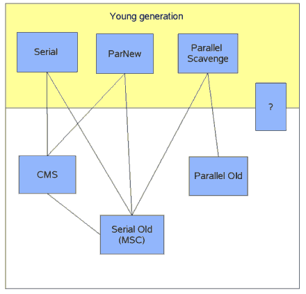
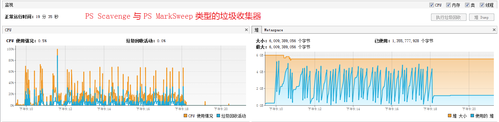
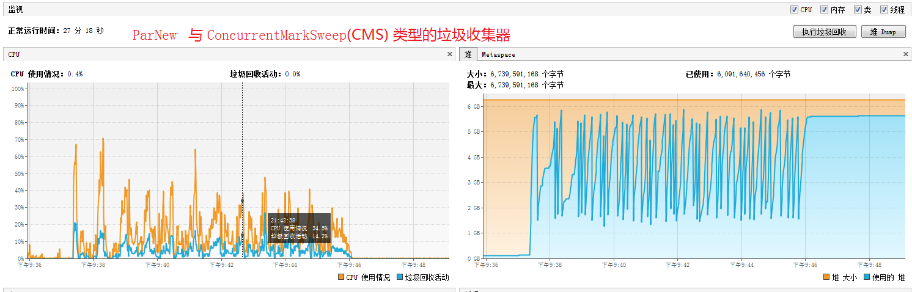
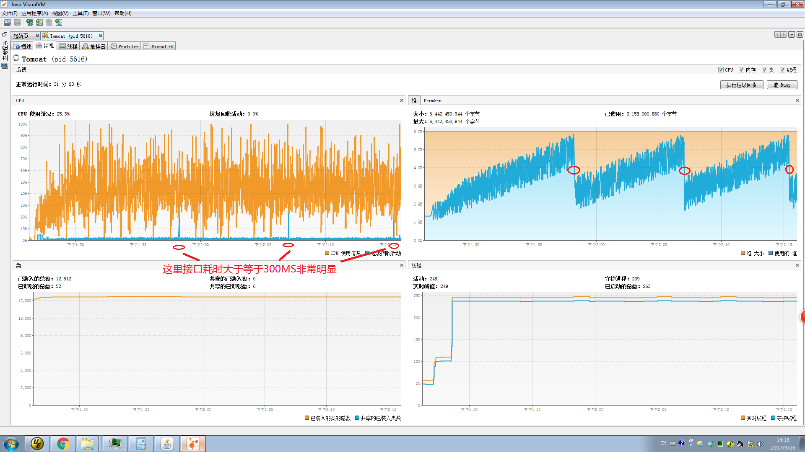
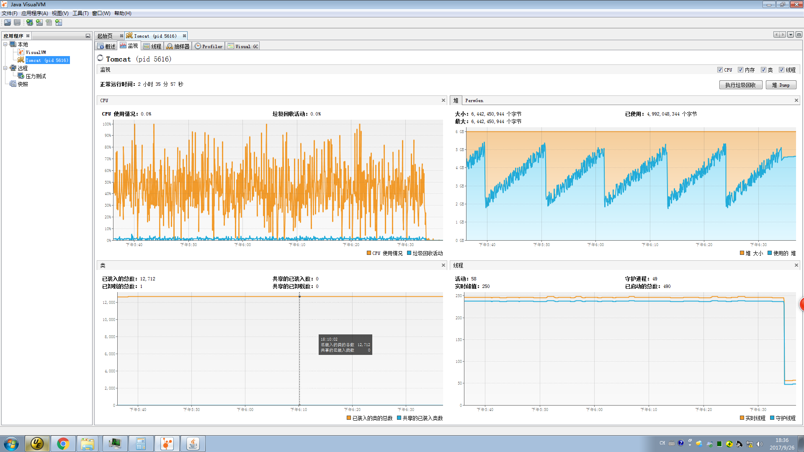

# 本工程的作用：
> * 记一次项目中，在JDK8环境下，并行GC月并发GC在Restful接口中体现差异。


# GC知识介绍
* `新生代`几种垃圾收集方式：
    * Serial (复制) 是一种stop-the-world(导致应用全部暂停，僵死一会儿), 使用单个GC线程进行复制收集。
      将幸存对象从 Eden复制到幸存 Survivor空间，并且在幸存Survivor空间之间复制，直到它决定这些对象已经足够长了，在某个点一次性将它们复制到旧生代old generation.
    * Parallel Scavenge (PS Scavenge)是一种stop-the-world, 使用多个GC线程实现复制收集。如同上面复制收集一样，但是它是并行使用多个线程。
    * ParNew是一种stop-the-world, 使用多个GC线程实现的复制收集，区别于"Parallel Scavenge"在于它与CMS可搭配使用，它也是并行使用多个线程，内部有一个回调功能允许旧生代操作它收集的对象。

* `老年代`几种垃圾收集方式：
    * Serial Old (MarkSweepCompact) 是一种stop-the-world, 使用单个线程进行mark-sweep-compact(标志-清扫-压缩) 收集。
    * Parallel Old (PS MarkSweep) 是一种使用多个GC线程压缩收集。
    * ConcurrentMarkSweep (CMS) 是最并行，低暂停的收集器。垃圾回收算法在后台不会暂停应用线程情况下实现大部分垃圾回收工作。
    * G1 使用 'Garbage First' 算法将堆空间划分为许多小空间。是一种跨年轻态和旧生代的回收。Java 7以后支持。

* `新生代`与`老年代`两种回收机制可搭配在一起工作图如下
    * 
    * 上图中黄色区域是年轻态，蓝色框子代表适用的几种垃圾回收方式；下方白色区域代表旧生代，蓝色也是代表在旧生代的回收方式，两种蓝色盒子之间的连线表示它们的搭配配置，
      比如Serial只能和CMS或Serial Old搭配使用，而ParNew只能和CMS或Serial Old使用，而Parallel Scavenge只能和Serail Old和Parallel Old使用，不能和CMS搭配使用。

*  在JVM中是+XX配置实现的搭配组合：
    * UseSerialGC 表示 "Serial" + "Serial Old"组合
    * UseParNewGC 表示 "ParNew" + "Serial Old"
    * UseConcMarkSweepGC 表示 "ParNew" + "CMS". 组合，"CMS" 是针对旧生代使用最多的
    * UseParallelGC 表示 "Parallel Scavenge" + "Serial Old"组合
    * UseParallelOldGC 表示 "Parallel Scavenge" + "Parallel Old"组合
*  在实践中使用UseConcMarkSweepGC 表示 "ParNew" + "CMS" 的组合是经常使用的

# JDK8不同启动方式默认启用的GC介绍
  * JDK8默认启动参数：-Xms2048M -Xmx2048M -XX:+PrintGC -Xloggc:/log/Jdk7GC.GCDeatil.log
    * 垃圾回收器的名称：Parallel Scavenge (PS Scavenge)(新生代)
    * 垃圾回收器的名称：Parallel Old (PS MarkSweep) (老年代)
    * 等于启动参数使用 -XX:+UseParallelOldGC
  * JDK8使用UseConcMarkSweepGC启动参数：-Xms2048M -Xmx2048M -XX:+UseConcMarkSweepGC -XX:+PrintGC -Xloggc:/log/Jdk7GC.GCDeatil.log
    * 垃圾回收器的名称：ParNew(新生代)
    * 垃圾回收器的名称：ConcurrentMarkSweep (老年代)


# 打包运行被测试的WebApp(注意后面增加远程监控Java VisualVM的方法)
  * 打包SpringBoot Jar 并上传到服务器特定目录
  * JDK8默认启动参数
    * nohup java $JAVA_OPTS -Xms6444M -Xmx6444M -XX:+PrintGC -Xloggc:/yun/log/Jdk8GC.GCDeatil.log -jar jdk8gc-0.0.1-SNAPSHOT.jar > jdk8gclog.file 2>&1 &
  * JDK8 使用CMS垃圾收集器使用
    * nohup java $JAVA_OPTS -Xms6444M -Xmx6444M -XX:+UseConcMarkSweepGC -XX:+PrintGC -Xloggc:/yun/log/Jdk8GC.GCDeatil.log -jar jdk8gc-0.0.1-SNAPSHOT.jar > jdk8gclog.file 2>&1 &

# 测试方法入口
  * 测试地址：http://hostName:8080/jdk7gcperformance/dobusiness
  * 统一使用JUnit代码测试远程接口  5个线程并发，每个线程循环执行4000次，测试入口在本工厂源码当中：Jdk7GcApplicationTests.jdk8GcRequest()方法
  * 测试JDK8默认启动参数的效果如下：nohup java $JAVA_OPTS -Xms6444M -Xmx6444M -XX:+PrintGC -Xloggc:/yun/log/Jdk8GC.GCDeatil.log -jar jdk8gc-0.0.1-SNAPSHOT.jar > jdk8gclog.file 2>&1 &
      ```
          ==》不同垃圾收集器的工作的次数与总耗时
          垃圾回收器的名称：PS Scavenge
          垃圾回收器已回收的总次数：239
          垃圾回收器已回收的总时间：32秒
          垃圾回收器的名称：PS MarkSweep
          垃圾回收器已回收的总次数：82
          垃圾回收器已回收的总时间：24秒
          ==》平均每次YoungGC时间0.133S， 每次OldGC时间0.292S
      ```
      ```
          ==》监测1分钟时间内接口响应时间大于300MS的频率
          1分钟内接口响应时间大于300MS：开始时间=1542771846283, 次数=79
          1分钟内接口响应时间大于300MS：开始时间=1542771906334, 次数=42
          1分钟内接口响应时间大于300MS：开始时间=1542771966366, 次数=40
          1分钟内接口响应时间大于300MS：开始时间=1542772026519, 次数=58
      ```
    * 测试JDK8使用CMS垃圾收集器效果如下： nohup java $JAVA_OPTS -Xms6444M -Xmx6444M -XX:+UseConcMarkSweepGC -XX:+PrintGC -Xloggc:/yun/log/Jdk8GC.GCDeatil.log -jar jdk8gc-0.0.1-SNAPSHOT.jar > jdk8gclog.file 2>&1 &
      ```
        ==》不同垃圾收集器的工作的次数与总耗时
        垃圾回收器的名称：ParNew                           
        垃圾回收器已回收的总次数：1549                     
        垃圾回收器已回收的总时间：52秒                     
        垃圾回收器的名称：ConcurrentMarkSweep              
        垃圾回收器已回收的总次数：44                       
        垃圾回收器已回收的总时间：1秒                      
        ==》平均每次YoungGC时间0.033S， 每次OldGC时间0.022S
      ```
      ```
        ==》监测1分钟时间内接口响应时间大于300MS的频率
        1分钟内接口响应时间大于300MS：开始时间=1542771349156, 次数=33
        1分钟内接口响应时间大于300MS：开始时间=1542771409216, 次数=30
        1分钟内接口响应时间大于300MS：开始时间=1542771469206, 次数=38
        1分钟内接口响应时间大于300MS：开始时间=1542771529249, 次数=28
      ```
      
# 验证结论(GC都是会Stop The Word的)
  1. 通过比较发现ParNew类型的YoungGC平均StopTheWord时间明显短于PS Scavenge(压测期间服务器的表现如下图)
      
  2. 通过比较发现CMS类型的OldGC平均StopTheWord时间明显短于PS MarkSweep(压测期间服务器的表现如下图)
      
  3. 大家都知道GC是会Stop The Word的，也就是会暂停Web服务器业务接口的响应，经过上面的比较，可以看到CMS配合使用的GC性能效果更优，可以提高系统吞吐量

# 作者为什么做这样的分享与总结
  1. 作者所在公司与全国第三大流量电商(某多多)有合作，他们使用了我们的一款产品。他们对我们产品提出了非常严格的要求：一分钟时间范围内接口响应时间大于300MS的要小于20个，一天24时间内这样的情况出现次数少于3次。
  产品刚开始上线，在下午流量最大的时候，超时频率逐渐增加，没有达到大厂的要求，作者就开始潜心分析问题、总结规律、分析GC日志，找到大概原因后，做了大量测压力测试，各种参数调优后再做压力测试，做各种压力测试效果比较，最终在生产环境上线，得到了非常好的效果。
  作者公司的产品是单体Web应用，扛下了第三大流量电商的服务，主流工作时间10小时内：接口调用在200W次左右，性能表现非常好。
  2. 调优前的服务器表现(刚上线的时候)
     
  3. 调优后的服务器表现
     
  4. 可以明显看到服务器CPU消耗较平稳，没有GC骤然占用CPU很多的情况出现。

# GC额外配置 最佳实战说明
  1. -XX:NewRatio=3：设置新生代与老年代的比例(需要根据企业产品的特征来做不同的设置：程序开辟内存驻留时间长短，手动销毁内存等)
  2. -XX:SurvivorRatio=8：设置新生代中Eden与Survivor的比例(需要根据企业产品的特征来做不同的设置,一般需要在测试环境做不同配置参数的压力测试，从而得到最佳配置) 
  3. -Xms6144M -Xmx6144M -XX:PermSize=128M -XX:MaxPermSize=256M: 这些较为常见不做详细介绍。-XX:MetaspaceSize是JDK8里面的。


# 服务器运行SpringBoot打包后的Jar，并开启Java VisualVM远程监控 办法
  * 进入JAVA_HOME\jre\lib\management\目录
  * 拷贝jmxremote.password.template这个文件到当前目录, 并改名为jmxremote.password
  * 打开jmxremote.password文件，去掉 # monitorRole  QED 和 # controlRole  R&D 这两行前面的注释符号
  * 编辑文件，命令:vim /etc/profile, 在最后增加如下内容(注意IP地址必须是外网能访问的地址，并非内网地址)
  ```
    export JAVA_OPTS='-Djava.rmi.server.hostname=52.80.111.111 -Dcom.sun.management.jmxremote=true -Dcom.sun.management.jmxremote.port=9001 -Dcom.sun.management.jmxremote.authenticate=false -Dcom.sun.management.jmxremote.ssl=false'
  ```
  * 应用最新配置信息，命令:source /etc/profile
  * 启动服务：nohup java $JAVA_OPTS -Xms6144M -Xmx6144M -XX:+PrintGC -Xloggc:/log/Jdk8GC.GCDeatil.log -jar jdk7gc-0.0.1-SNAPSHOT.jar > jdk8gclog.file 2>&1 &  
  * 注意不要分多个窗口执行上面的命令，不然可能会因为配置文件不生效(source /etc/profile)导致远程监控不生效
  * 排查远程监控不成功的方法，在ps -ef | grep java 的结果中，可以看到启动参数
  * 参考《https://blog.csdn.net/u011391839/article/details/76984995》《https://blog.csdn.net/luosai19910103/article/details/75574725》


